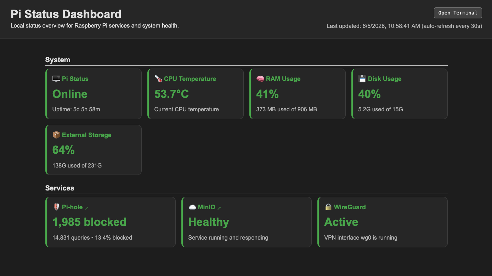

# Pi Status Dashboard

A lightweight dashboard for monitoring Raspberry Pi system health and homelab services. The dashboard collects status information from the local system and displays it through a responsive web interface.

## Features

- System uptime monitoring
- CPU temperature monitoring
- Memory usage monitoring
- Disk usage monitoring
- Pi-hole service status
- MinIO service status
- WireGuard service status
- Responsive dashboard layout
- Modular service architecture for adding additional checks

## Technologies Used

- Node.js
- Express
- HTML5
- CSS3
- JavaScript
- Linux systemd services

## Architecture

The dashboard runs locally on a Raspberry Pi and gathers information from the operating system and installed services.

```text
Browser
  ↓
Express Server
  ↓
Service Modules
  ├── System Metrics
  ├── Pi-hole
  ├── MinIO
  └── WireGuard
```

## Screenshot

### Dashboard Overview



## Project Structure

```text
pi-status-dashboard/
├── public/
│   ├── index.html
│   ├── styles.css
│   └── app.js
├── services/
│   ├── system.js
│   ├── pihole.js
│   ├── minio.js
│   └── wireguard.js
├── server.js
├── package.json
└── README.md
```

## Possible Future Improvements

- Backup status monitoring
- MinIO health endpoint checks
- Pi-hole statistics integration
- Additional homelab service checks

## Notes

This project is intended for personal homelab monitoring and is designed to run on a Raspberry Pi over a trusted local network or VPN connection.
